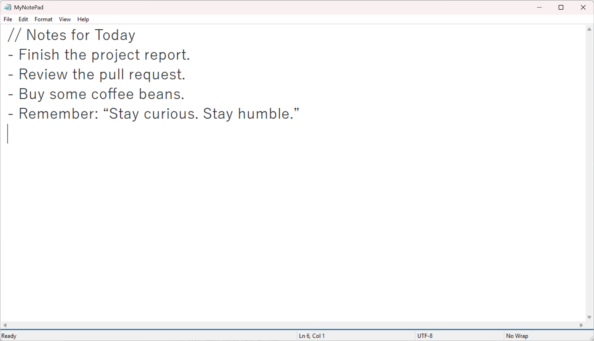

# MyNotePad

A modern Windows Notepad application with enhanced editing features and print support.




## 📋 Table of Contents

- [Features](#-features)
- [Downloads](#-downloads)
- [Build Instructions](#️-build-instructions)
- [Testing](#-testing)
- [Code Quality](#-code-quality)
- [Technical Details](#-technical-details)
- [Contributing](#-contributing)
- [License](#-license)
- [Acknowledgments](#acknowledgments)


## ✨ Features

**Fully implements all functionality of the classic Windows Notepad with modern enhancements.**

### 📝 Text Editing

- **Modern Editing Interface** - Uses Segoe UI font with white background and dark gray text
- **Multi-line Editing Support** - Proper handling of line breaks and Tab key support
- **Undo Functionality** - Support for undo/redo operations
- **Select All** - Ctrl+A keyboard shortcut and menu option

### 🔍 Find and Replace

- **Find Dialog** - Support for forward/backward search
- **Replace Functionality** - Single replace and replace all operations
- **Advanced Options** - Case sensitive and whole word matching

### 📄 File Operations

- **Multi-encoding Support** - Auto-detection of UTF-8, GBK, ANSI, UTF-16 and other encodings
- **Cross-platform Line Endings** - Support for Windows (CRLF), Unix (LF), and Mac (CR) line endings
- **Smart Save** - Preserves original file encoding format

### 🖨️ Print Features

- **Smart Font Scaling** - Automatically adjusts font size based on printer DPI
- **Mixed CJK and Latin Text Printing** - Correct handling of Chinese character widths
- **Automatic Pagination** - Smart calculation of page layout and pagination
- **Page Setup** - Support for margins and paper settings

## 📦 Downloads

### Download from Releases

Visit the [Releases page](https://github.com/bugparty/MyNotePad/releases) to download the latest version.

### Download from Artifacts

After each build, you can download the latest build results from the Actions page.

## 🏗️ Build Instructions

### Local Build

#### System Requirements

- Windows 10/11
- Visual Studio 2019/2022 (Community edition is sufficient)
- Windows SDK

#### Build Steps

```powershell
# Clone the repository
git clone https://github.com/bugparty/MyNotePad.git
cd MyNotePad
./build.ps1
```

### Automated Build (GitHub Actions)

The project is configured with GitHub Actions for automated builds:

- **Triggers**: Push to main/master branches, Pull Requests, or Release publishing
- **Build Environment**: Windows Server 2022
- **Output**: Release version exe files
- **Artifacts**: Each build uploads executable files to GitHub

#### Release Process

1. **Development Push**: Pushing code to main branch triggers build and uploads artifacts
2. **Create Release**: Creating git tags and releases automatically builds and attaches zip packages

```powershell
# Create version tag
git tag v1.0.0
git push origin v1.0.0

# Create Release on GitHub to trigger automatic build and file attachment
```

## 🧪 Testing

MyNotePad includes a comprehensive test suite using **Google Test** framework.

### Running Tests

#### Prerequisites
```powershell
# Install vcpkg
git clone https://github.com/microsoft/vcpkg.git C:\vcpkg
C:\vcpkg\bootstrap-vcpkg.bat

# Install Google Test
C:\vcpkg\vcpkg.exe install gtest:x86-windows
```

#### Build and Run
```powershell
# Build test project
msbuild MyNotePad.Tests\MyNotePad.Tests.vcxproj /p:Configuration=Debug /p:Platform=Win32

# Run tests
.\Debug\MyNotePad.Tests.exe

# Run with XML output
.\Debug\MyNotePad.Tests.exe --gtest_output=xml:test-results.xml
```

### Test Coverage

Current test coverage includes:
- Encoding detection and conversion (UTF-8, UTF-16, GBK)
- Line ending normalization (CRLF, LF, CR)
- Utility functions and memory management

For detailed testing guide, see [TESTING_GUIDE.md](docs/TESTING_GUIDE.md).

## 🔍 Code Quality

### Static Analysis

The project uses **Cppcheck** for static code analysis to detect:
- Memory leaks and resource management issues
- Null pointer dereferences
- Buffer overflows
- Code style and performance issues

Static analysis runs automatically in CI/CD pipeline on every push and pull request.

### CI/CD Pipeline

Enhanced CI/CD pipeline includes:

1. **Static Analysis** - Automated code quality checks with Cppcheck
2. **Unit Tests** - Automated testing with Google Test
3. **Build** - Multi-configuration builds (Debug/Release)
4. **Quality Gate** - Ensures code meets quality standards
5. **Release** - Automated packaging and deployment

**Pipeline Features**:
- ✅ Parallel job execution for faster builds
- ✅ Automated test result reporting
- ✅ Code quality metrics and trends
- ✅ Artifact retention and versioning

For detailed CI/CD documentation, see [CI_CD_ENHANCED.md](docs/CI_CD_ENHANCED.md).

### Code Quality Standards

All code must pass:
- ✅ Cppcheck static analysis (zero errors)
- ✅ Unit tests (all passing)
- ✅ Build verification (both Debug and Release)
- ✅ Code review (for pull requests)

## 🔧 Technical Details

### Architecture

- **Language**: C++ (Visual C++)
- **UI Framework**: Win32 API
- **Character Encoding**: Unicode (UTF-16) internal processing
- **Compiler**: MSVC 2019/2022

### Key Components

- `MyNotePad.cpp` - Main program and window procedures
- `Dialog.cpp` - Dialog boxes and editing functionality
- `Document.cpp` - File I/O and encoding handling
- `Encoding.cpp` - Encoding detection and conversion
- `Utils.cpp` - Utility functions

### Dependencies

- Windows SDK
- ComCtl32.lib (Common Controls)
- comdlg32.lib (Common Dialogs)

## 🤝 Contributing

Issues and Pull Requests are welcome!

### Development Workflow

1. Fork the project
2. Create a feature branch (`git checkout -b feature/amazing-feature`)
3. **Write tests** for new functionality
4. Ensure all tests pass locally
5. Commit your changes (`git commit -m 'Add amazing feature'`)
6. Push the branch (`git push origin feature/amazing-feature`)
7. Create a Pull Request

### Code Standards

- Use TCHAR and related macros for Unicode support
- Follow Windows API naming conventions
- Add appropriate error handling and memory management
- **Write unit tests** for new features
- Ensure **static analysis** passes without errors
- Keep code coverage above baseline

### Pull Request Requirements

Before submitting a PR:
- ✅ All unit tests pass
- ✅ Cppcheck reports zero errors
- ✅ Code builds without warnings
- ✅ New features include tests
- ✅ Documentation is updated

## 📄 License

This project is licensed under the MIT License - see the [LICENSE](LICENSE) file for details.

## Acknowledgments

This project recreates the functionality of Microsoft Windows Notepad as a programming exercise and educational tool, demonstrating classic Windows application development techniques.
